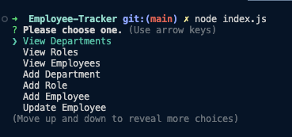
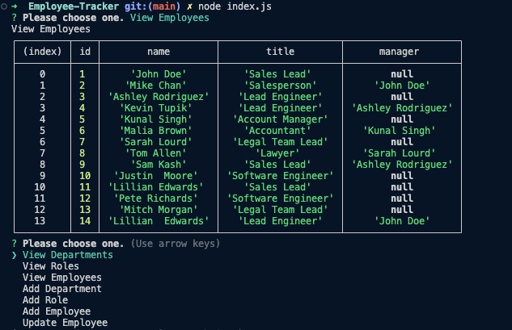

# Employee-Tracker 🗃️

## Description 
Business owners need to be able to manage their department, roles, and employees in their company to stay organized and plan their businesses. That's where this CLI employee tracker comes to play!  

## Installation 🖥️
To install this employee-tracker git clone the repository onto your local environment. Run "npm i" to install the node modules needed for functionality. Then run "node index.js" to bring up the CLI. 

## Usage 📸

[Google Drive Link to Screen Recording](https://drive.google.com/file/d/1vj15E6IVa6cCi-JR_Gy34XNB6CyJbbjG/view)

## Credits 💳
I worked on this project alone, but received help from my tutor and TA, Justin Moore.

## License 🪪
This project is not licensed. 

## Features 📝
- Choose to view departments, roles, or employees to view tables containing this information. 
- Choose to add employee, add a role, or add a department via Inquirer. 
-Choose to update an employee with their new role and manager. 

## How to Contribute 🤝🏼
If you would like to contribute to this project, please contact the creator via LinkedIn: [Lillian Edwards](https://www.linkedin.com/in/lillian-edwards63/)

## Tests 🧪
There are no tests available on this application at this time. 

